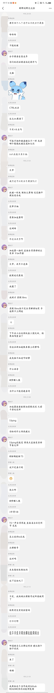

<div align="center">

# JUHKFF-PLUGIN


<br>


</div>

一个适用于 [TRSS-Yunzai 框架](https://github.com/TimeRainStarSky/Yunzai) 和 [OneBot-v11 标准](https://onebot.dev) 的 **自用** 综合群机器人插件

> [!WARNING]
> 由于为自用插件，所以其它协议适配性未知，喵崽框架适配性未知（没运行过）
>
> **为调整结构和便于之后 AI 功能扩展，插件整体使用 typescript 重写，可能会有些新 Bug 出现，望理解和反馈。如果遇到问题可尝试重装插件**

<div style="color:red; font-weight:bold;">
由于群聊接口配置结构发生变动，可能需要重新进行配置
</div>

## 安装插件

#### 1. 克隆仓库

- github

```
git clone https://github.com/juhkff/juhkff-plugin.git ./plugins/juhkff-plugin
```

- gitee（国内）

```
git clone https://gitee.com/juhkff/juhkff-plugin.git ./plugins/juhkff-plugin
```

#### 2. 安装依赖

```
pnpm install --filter=juhkff-plugin
```

## API 相关

- SiliconFlow 官网申请 ApiKey: https://cloud.siliconflow.cn/account/ak
- DeepSeek 官网申请 ApiKey: https://platform.deepseek.com/
- 火山方舟 官网申请 ApiKey 和创建应用: https://console.volcengine.com/ark/
- Gemini 官网申请 ApiKey: https://aistudio.google.com/apikey

### 一点使用经验

火山方舟创建应用时，如果想使用联网搜索，最好将联网内容插件全勾选，不然搜索内容可能过时或质量较差

## 插件配置

> [!WARNING]
> 不建议手动修改配置文件，本插件已兼容 [Guoba-plugin](https://github.com/guoba-yunzai/guoba-plugin) ，请使用锅巴插件对配置项进行修改 <br>
> 若手动修改配置文件，需至少启动一次插件，然后可在 `juhkff-plugin/config/default` 目录下的文件内找到配置项说明，据此修改 `juhkff-plugin/config` 目录下的相应文件，保存后重启机器人。**请勿直接修改 default 目录及其内文件**

## 功能列表

- [x] 主动群聊
  - [x] 支持上下文
  - [x] 视觉模型开启时，会对图片提取关键内容加入上下文
  - [x] 视觉模型可以代替聊天模型完全接管主动群聊
  - [x] 可以提取分享的 URL 内容并加入上下文
  - [x] 一定程度上支持对分享链接的解析并加入上下文
  - [x] 添加情感生成，会加入 API 接口调用中辅助生成群聊内容（神必功能，谨慎开启
  - [x] **支持通过 AI 功能实现文本转语音（latest update）（目前实现较简单）** 
  - [x] 支持的 API 列表：
    - [x] DeepSeek
    - [x] SiliconFlow
    - [x] 火山方舟
    - [x] **Gemini（latest update）**  
- [x] 生成和推送日报
  - [x] 借鉴 [真寻日报](https://github.com/HibiKier/nonebot-plugin-zxreport) 的样式和代码生成日报
- [x] 表情偷取
  - [x] 借鉴 [鸢尾花插件](https://github.com/logier/logier-plugins) 的思路改进实现
  - [x] 同一图片在指定时间长度内被发送两次，则被视为表情并偷取
- [x] AI 功能接入中
  - [x] 豆包 AI 部分接入
  - [x] **SiliconFlow AI 接入（latest update）**
  - TODO: 其它 AI 接入...
- [x] 调用指令可发送帮助图片
  - [x] 参考 [Miao-Plugin](https://github.com/yoimiya-kokomi/miao-plugin) 和 [TRSS-Yunzai](https://github.com/TimeRainStarSky/Yunzai) 的思路和代码实现
  - [x] 支持手动添加其它命令，如其它插件的命令
  <details>
    <summary>图片效果预览</summary>
    
  </details>
- [x] 其它
  - [x] 插件配置页面优化（长期）
- [ ] TODO...

## 主动群聊预览

<details>
  <summary><b>真实情景</b> 可以据此判断是否符合使用预期</summary>
  
</details>

## 支持与贡献

如果你喜欢这个项目，请不妨点个 Star🌟，这是对开发者最大的动力

**自用插件，不保证问题追踪和改进**

## 许可证

本项目使用 [GNU GPLv3](https://choosealicense.com/licenses/gpl-3.0/) 作为开源许可证。
